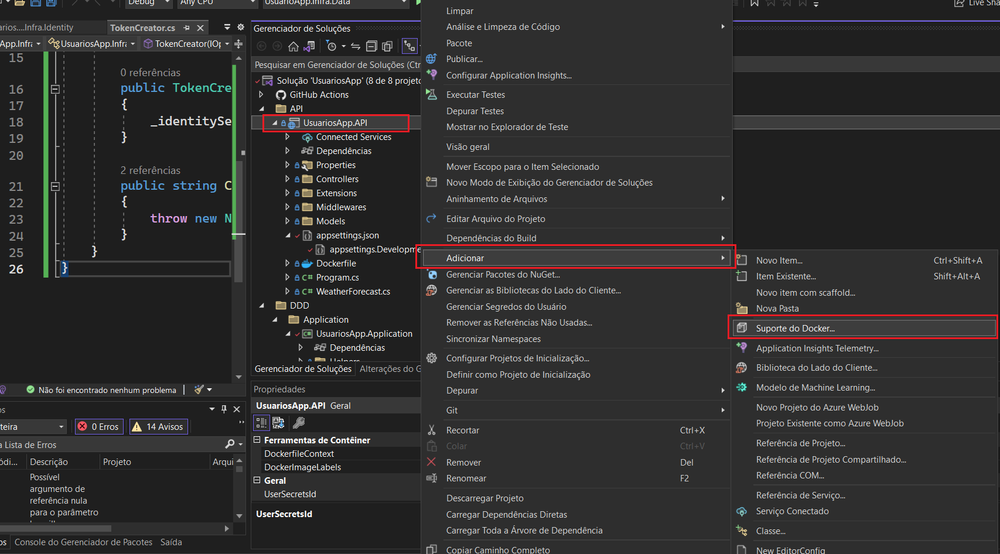

# Controle de Usuários

Este projeto é um exemplo de controle de usuários construído com ASP.NET 7. Ele implementa serviços de autenticação e criação de usuário usando o Identity Framework.

## Funcionalidades

O projeto possui as seguintes funcionalidades:

- Autenticação de usuários
- Criação de usuários

## Tecnologias

O projeto utiliza as seguintes tecnologias:

- ASP.NET 7
- Entity Framework Core
- JWT
- AutoMapper
- EF Core (code first)


## Configuração

Para configurar o projeto, siga os seguintes passos:

1. Clone o repositório para sua máquina local
2. Abra o arquivo `appsettings.json` e configure a string de conexão com o banco de dados
3. Abra o Visual Studio e execute o comando `dotnet ef database update` no Console do Gerenciador de Pacotes para criar o banco de dados
4. Inicie o projeto


## Para realizar teste


<b>xUnit</b> - Projeto utilizado para testar os endpoints (outra opção seria o NUnit)

````c#
/*Adicionar esse código dentro da Program 
 Define a classe program como publica para poder ser utilizada em outro lugar (como será utilizada no xUnit) */
public partial class Program { }
````


Utilizando o `Bogus` para gerar o dado mockado cria a requisição do teste utilizando o `Microsoft.AspNetCore.Mvc.Testing`


```c#
 using Bogus;
using FluentAssertions;
using System.Net;
using UsuariosApp.Application.Models.Requests;
using UsuariosApp.Tests.Helpers;
using Xunit;

namespace UsuariosApp.Tests
{
    public class UsuariosTest
    {
        [Fact]
        public async Task Usuarios_Post_CriarConta_Returns_Created()
        {
            var faker = new Faker("pt_BR");
            var request = new CriarContaRequestDTO
            {
                Nome = faker.Person.FullName,
                Email = faker.Internet.Email(),
                Senha = "@Teste123"
            };

            var content = TestHelper.CreateContent(request);
            var result = await TestHelper.CreateClient.PostAsync("/api/usuarios/criar-conta", content);

            result.StatusCode
                .Should()
                .Be(HttpStatusCode.Created);

            var response = TestHelper.ReadResponse<CriarContaResponseDTO>(result);

            response.Id.Should().NotBeEmpty();
            response.Nome.Should().Be(request.Nome);
            response.Email.Should().Be(request.Email);
            response.DataHoraCriacao.Should().NotBeNull();
        }
    }
}
```

<b>Bogus</b> - Ferramenta utilizada para gerar dados mock / mocados

<b>Fluent Assertions</b> - Valida o dado com o esperado

<b>Microsoft.AspNetCore.Mvc.Testing</b> - Utilizado para enviar requisições para o endpoint que serão testados 

Configurando o HttpClient para requisitar os endpoints do projeto (Program). Caso seja uma API externa só configurar a URL no httClient em vez de usar `Microsoft.AspNetCore.Mvc.Testing` 

```C#

using Microsoft.AspNetCore.Mvc.Testing;
using Newtonsoft.Json;
using System;
using System.Collections.Generic;
using System.Linq;
using System.Text;
using System.Threading.Tasks;

namespace UsuariosApp.Tests.Helpers
{
    public static class TestHelper
    {
        /// <summary>
        /// Método para criar um client http da api de usuários
        /// </summary>
        public static HttpClient CreateClient
            => new WebApplicationFactory<Program>().CreateClient();

        /// <summary>
        /// Método para serializar o contedo da requisição que será enviada para um serviço
        /// </summary>
        public static StringContent CreateContent<TRequest>(TRequest request)
            => new StringContent(JsonConvert.SerializeObject(request),
                Encoding.UTF8, "application/json");
    }
}

```

## Gerar arquivo docker (Dockerfile)




## Orquestração docker
- No projeto API clique com a direita `Adicionar > Suporte de Orquestrador de Contêiner`
- Ele irá gerar um arquivo base e você precisará adicionar as dependências desse projeto como segue abaixo: 
````yml
version: '3.4'

services:
  usuariosapp.api:
    image: ${DOCKER_REGISTRY-}usuariosappapi
    build:
      context: .
      dockerfile: UsuariosApp.API/Dockerfile
    ports:
        - "8080:8080"
    depends_on:
        - db
    links:
        - rabbitmq
  db:
    image: mcr.microsoft.com/mssql/server:2019-latest
    environment:
        SA_PASSWORD: "@Coti2023"
        ACCEPT_EULA: "Y"
    ports:
        - "1433:1433"
  rabbitmq:
    image: rabbitmq:3-management
    hostname: "rabbitmq"
    ports:
        - "5672:5672"
        - "15672:15672"


```` 

## versão 2 orquestador
````yml
version: '3.4'

#nos comentarios nao adicionar acentuacao senao vai quebrar no momento de dar docker-compose build
services:
  usuariosapp.api:
    container_name: usuariosapp_api #define os nomes da aplicacao
    image: ${DOCKER_REGISTRY-}usuariosappapi
    build:
      context: .
      dockerfile: UsuariosApp.API/Dockerfile
    ports:
        - 54321:80  
    depends_on: #Define as dependencias do projeto
        - db 
        - rabbitmq
  db: #esse nome voce pode definir da forma que voce quiser
    container_name: usuariosapp_db
    image: mcr.microsoft.com/mssql/server:2019-latest
    environment:
        SA_PASSWORD: "@Coti2023"
        ACCEPT_EULA: "Y"
    ports:
        - "1433:1433"
  rabbitmq:
    container_name: usuariosapp_rabbitmq
    image: rabbitmq:3-management
    hostname: "rabbitmq"
    ports:
        - "5672:5672"
        - "15672:15672"
    expose:
        - 5672   # Por mais que as portas estejam ja definidas as vezes acontece de nao conseguir abrir
        - 15761  # para evitar esse problema utilize o expose para forcar a saida da porta 
    environment:
        - RABBITMQ_DEFAULT_USER=guest
        - RABBITMQ_DEFAULT_PASS=guest


````


- Após isso você precisara abrir CMD, acessar a pasta `C:\Users\infis001077\source\repos\UsuariosApp`

- Use o comando `docker-compose build` ou `docker-compose -d` (que irá buildar e logo em seguida usar o up)
- Ele baixará as dependÊncia e por ultimo utilize o comando `docker-compose up` 
- Para derrubar o docker, vai na pasta local do docker `docker-compose down` isso irá limpar todos container e deletar tudo. Pra caso de bugs etc pode seguir esses comandos 
  - `docker-compose down`  - Limpa todos container deleta toda selas, caso tenha banco de dados dentro do projeto ele irá derrubar o banco de dados também, todos os dados serão perdidos
  - `docker-compose build` - Builda novamente todas configs do docker-compose.yml
  - `docker-compose up` - sobe aplicação


Web.API via docker configs
```json

//Nota que nessa configuração data source=db aponta apra db, que é o nome da imagem que subiu no docker
{
  "ConnectionStrings": {
    "UsuariosApp": "Data Source=db;Initial Catalog=master;User ID=sa;Password=@Coti2023;TrustServerCertificate=true;"
  },
  "MessageSettings": {
    "Hostname": "rabbitmq",
    "Port": 5672,
    "Username": "guest",
    "Password": "guest",
    "Queue": "mensagens_usuario"
  },
  "Logging": {
    "LogLevel": {
      "Default": "Information",
      "Microsoft.AspNetCore": "Warning"
    }
  },
  "AllowedHosts": "*"
}
```


Gerar migration por fora
```json
//Nota que nessa configuração data source acessa por fora o banco de dados, para poder realizar testes e subir migrations
{
  "ConnectionStrings": {
    "UsuariosApp": "Data Source=localhost,1433;Initial Catalog=master;User ID=sa;Password=@Coti2023;TrustServerCertificate=true;"
  }
}

```

