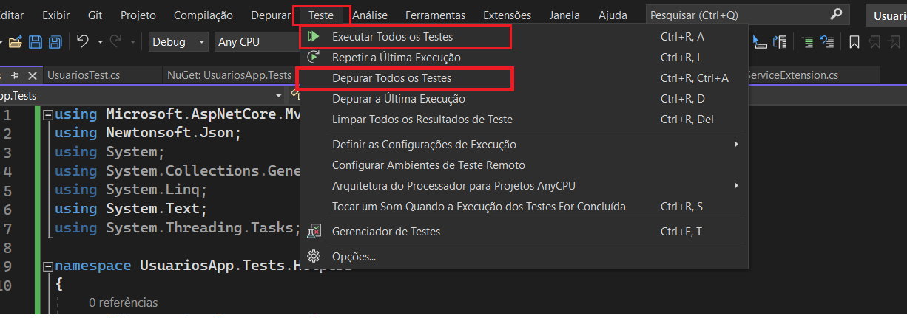

# Controle de Usuários

Este projeto é um exemplo de controle de usuários construído com ASP.NET 7. Ele implementa serviços de autenticação e criação de usuário usando o Identity Framework.

## Funcionalidades

O projeto possui as seguintes funcionalidades:

- Autenticação de usuários
- Criação de usuários

## Tecnologias

O projeto utiliza as seguintes tecnologias:

- ASP.NET 7
- Entity Framework Core
- JWT
- AutoMapper
- EF Core (code first)


## Configuração

Para configurar o projeto, siga os seguintes passos:

1. Clone o repositório para sua máquina local
2. Abra o arquivo `appsettings.json` e configure a string de conexão com o banco de dados
3. Abra o Visual Studio e execute o comando `dotnet ef database update` no Console do Gerenciador de Pacotes para criar o banco de dados
4. Inicie o projeto


## Para realizar teste


<b>xUnit</b> - Projeto utilizado para testar os endpoints (outra opção seria o NUnit)

````c#
/*Adicionar esse código dentro da Program 
 Define a classe program como publica para poder ser utilizada em outro lugar (como será utilizada no xUnit) */
public partial class Program { }
````




Utilizando o `Bogus` para gerar o dado mockado cria a requisição do teste utilizando o `Microsoft.AspNetCore.Mvc.Testing`


```c#
 using Bogus;
using FluentAssertions;
using System.Net;
using UsuariosApp.Application.Models.Requests;
using UsuariosApp.Tests.Helpers;
using Xunit;

namespace UsuariosApp.Tests
{
    public class UsuariosTest
    {
        [Fact]
        public async Task Usuarios_Post_CriarConta_Returns_Created()
        {
            var faker = new Faker("pt_BR");
            var request = new CriarContaRequestDTO
            {
                Nome = faker.Person.FullName,
                Email = faker.Internet.Email(),
                Senha = "@Teste123"
            };

            var content = TestHelper.CreateContent(request);
            var result = await TestHelper.CreateClient.PostAsync("/api/usuarios/criar-conta", content);

            result.StatusCode
                .Should()
                .Be(HttpStatusCode.Created);

            var response = TestHelper.ReadResponse<CriarContaResponseDTO>(result);

            response.Id.Should().NotBeEmpty();
            response.Nome.Should().Be(request.Nome);
            response.Email.Should().Be(request.Email);
            response.DataHoraCriacao.Should().NotBeNull();
        }
    }
}
```

<b>Bogus</b> - Ferramenta utilizada para gerar dados mock / mocados

<b>Fluent Assertions</b> - Valida o dado com o esperado

<b>Microsoft.AspNetCore.Mvc.Testing</b> - Utilizado para enviar requisições para o endpoint que serão testados 

Configurando o HttpClient para requisitar os endpoints do projeto (Program). Caso seja uma API externa só configurar a URL no httClient em vez de usar `Microsoft.AspNetCore.Mvc.Testing` 

```C#

using Microsoft.AspNetCore.Mvc.Testing;
using Newtonsoft.Json;
using System;
using System.Collections.Generic;
using System.Linq;
using System.Text;
using System.Threading.Tasks;

namespace UsuariosApp.Tests.Helpers
{
    public static class TestHelper
    {
        /// <summary>
        /// Método para criar um client http da api de usuários
        /// </summary>
        public static HttpClient CreateClient
            => new WebApplicationFactory<Program>().CreateClient();

        /// <summary>
        /// Método para serializar o contedo da requisição que será enviada para um serviço
        /// </summary>
        public static StringContent CreateContent<TRequest>(TRequest request)
            => new StringContent(JsonConvert.SerializeObject(request),
                Encoding.UTF8, "application/json");
    }
}

```